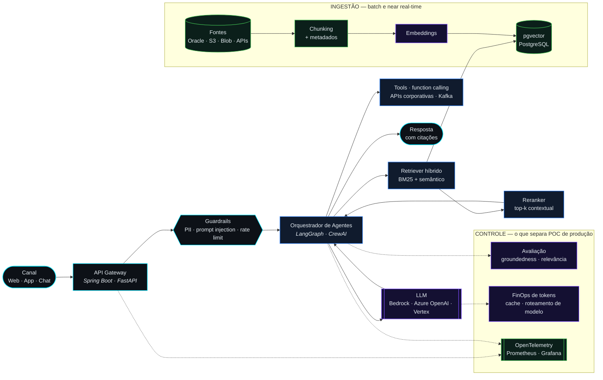

<div align="center">


<br/>

<a href="https://readme-typing-svg.demolab.com">
  
</a>

<br/>

<a href="https://www.linkedin.com/in/mkmcp/">
  
</a>
<a href="mailto:contato.maikoncanuto@gmail.com">
  
</a>


</div>

## `⬢` MISSION BRIEF

```console
$ whoami --verbose
```

Engenheiro de software **há mais de 9 anos**, especializado em **backend Java/Spring Boot** aplicado a
sistemas financeiros críticos e, nos últimos anos, em **IA Generativa** aplicada a soluções corporativas.

> É uma combinação ainda rara: quem domina sistemas bancários de alta disponibilidade
> raramente vem do lado dos LLMs — e vice-versa.

Na prática, meu trabalho é: **modernizar legado sem parar a operação**, decompor monolitos,
integrar plataformas que nunca foram feitas para conversar e sustentar aplicações onde
indisponibilidade tem **custo real**. Além do código, atuo como **líder técnico e arquiteto**:
defino padrões, reviso soluções, apoio times e traduzo necessidade de negócio em arquitetura.

<div align="center">

| `⬡` | Domínio | Sinal de senioridade |
|:---:|:---|:---|
| **01** | Sistemas financeiros | Bancos, seguros e meios de pagamento em alta disponibilidade |
| **02** | Modernização de legado | Decomposição de monolitos com migração gradual, sem downtime |
| **03** | Event-driven | Kafka, RabbitMQ, IBM MQ, sagas, idempotência e resiliência |
| **04** | IA Generativa | RAG, agentes e chatbots com avaliação, segurança e controle de custo |
| **05** | Observabilidade | OpenTelemetry, Prometheus, Grafana, Elastic — tracing distribuído |
| **06** | Liderança técnica | Padrões, code review, mentoria, estimativas e pré-vendas |


</div>

## `⬢` TECH STACK

<div align="center">

**`CORE`** — o que eu escrevo todos os dias


<br/><br/>

**`DATA · MESSAGING`**


<br/><br/>

**`CLOUD · PLATFORM`**


<br/><br/>

**`GENERATIVE AI`**


<br/>

**`RUNTIME · OBSERVABILITY · QUALITY`**


</div>

## `⬢` GENERATIVE AI — REFERENCE ARCHITECTURE

O padrão que eu levo para produção. O diferencial não é chamar o LLM: é o que existe **em volta** dele
— guardrails, avaliação contínua, tracing e teto de custo.



<div align="center">


</div>

## `⬢` FLIGHT LOG

<div align="center">

| Período | Posição | Organização | Frente principal |
|:---:|:---|:---|:---|
| `2025 →` | **Engenheiro de Software Sênior** | Mirante Tecnologia | Huawei · Via Varejo · GenAI |
| `2024 – 2025` | **Especialista em Tecnologia e Arquitetura** | Provider IT | C&A · Generali Seguros |
| `2024` | **Arquiteto de Soluções e Pré-vendas** | Provider IT | POCs com LLMs, RAG e agentes |
| `2023` | **Arquiteto de Software Sênior** | Provider IT | Itaú · Porto Seguro |
| `2022` | **Arquiteto de Software** | Mirante Tecnologia | Banco do Brasil |
| `2021 – 2022` | **Desenvolvedor Sênior** | Mirante Tecnologia | Sicoob |
| `2020 – 2021` | **Líder Técnico** | CWI Software | Itaú · Bradesco Seguros |
| `2019 – 2020` | **Engenheiro de Software Sênior** | CWI Software | Banco Votorantim |
| `2018 – 2019` | **Desenvolvedor Full Stack** | Stefanini | Caixa Econômica Federal |
| `2017 – 2018` | **Desenvolvedor** | Stefanini | Correios · Polícia Federal |

</div>

<details>
<summary><b><code>⬡</code> Abrir detalhamento técnico por cliente</b></summary>

<br/>

**Mirante Tecnologia — Engenheiro de Software Sênior** · `07/2025 → atual`
- **Huawei** — componentes de backend em Java e Python, definição de integrações, APIs e padrões; representação técnica da squad junto a clientes e parceiros.
  <br/>`Java 17/21` `Spring Boot` `Spring Cloud` `FastAPI` `Kafka` `PostgreSQL` `Redis` `React` `Angular` `K8s` `Huawei Cloud` `AWS` `Terraform` `OTel`
- **Via Varejo** — microsserviços e APIs para varejo e e-commerce; modernização de integrações com pedidos, pagamentos, logística e atendimento.
  <br/>`Java 17` `Spring Boot` `Node.js` `FastAPI` `Kafka` `RabbitMQ` `MongoDB` `Next.js` `AWS` `GitHub Actions`
- **IA Generativa** — sistemas RAG, agentes e chatbots corporativos; preparação, especialização e avaliação de modelos; segurança, observabilidade e controle de custos.
  <br/>`OpenAI` `Azure OpenAI` `Bedrock` `Gemini` `Vertex AI` `LangChain` `LangGraph` `CrewAI` `pgvector` `n8n`

**Provider IT — Especialista em Tecnologia e Arquitetura de Soluções** · `07/2024 – 06/2025`
- **C&A** — arquitetura de integrações para plataformas de varejo e canais digitais; definição de APIs, eventos e padrões.
- **Generali Seguros** — arquitetura de modernização de sistemas de seguros; integração entre propostas, apólices, faturamento e atendimento; migração gradual de legado.
  <br/>`Spring Batch` `REST + SOAP` `Oracle` `Azure` `Elastic Stack`

**Provider IT — Arquiteto de Soluções e Pré-vendas** · `01/2024 – 06/2024`
- Provas de conceito com LLMs, RAG, agentes e chatbots; propostas, estimativas, cronogramas e dimensionamento de equipes; avaliação de tecnologias, riscos e custos.

**Provider IT — Arquiteto de Software Sênior** · `01/2023 – 12/2023`
- **Itaú** — arquiteturas para sistemas bancários de alta disponibilidade; modernização de aplicações, APIs e integrações corporativas.
  <br/>`Quarkus` `OpenShift` `GitLab CI` `Kafka` `Oracle` `AWS` `Azure`
- **Porto Seguro** — plataformas e integrações para produtos e jornadas de seguros; APIs entre canais digitais e sistemas internos.

**Mirante Tecnologia — Arquiteto de Software** · `04/2022 – 12/2022`
- **Banco do Brasil** — modernização de aplicações bancárias; integração entre legado, APIs e serviços distribuídos; componentes reutilizáveis, logs estruturados, métricas, alertas e tracing distribuído; diagramas e ADRs.
  <br/>`Java 11/17` `IBM MQ` `Kafka` `OpenShift` `Terraform`

**Mirante Tecnologia — Desenvolvedor Sênior** · `07/2021 – 03/2022`
- **Sicoob** — serviços para plataformas financeiras; padrões de API, microsserviços e comunicação orientada a eventos; redução de acoplamento com legado.

**CWI Software — Líder Técnico** · `07/2020 – 06/2021`
- **Itaú** — backend para ambientes bancários de alta criticidade; decomposição de monolitos; comunicação assíncrona e event-driven; code review e definição de padrões.
- **Bradesco Seguros** — produtos, propostas, apólices e jornadas de atendimento; integração entre aplicações modernas e legado de seguros; liderança técnica da equipe.

**CWI Software — Engenheiro de Software Sênior** · `07/2019 – 06/2020`
- **Banco Votorantim** — APIs e microsserviços para jornadas bancárias; regras de clientes, contas, crédito e transações; testes automatizados.

**Stefanini — Desenvolvedor Full Stack / Desenvolvedor** · `01/2017 – 07/2019`
- **Caixa Econômica Federal** — sistemas bancários integrados a plataformas legadas; rotinas de processamento; análise de incidentes em homologação e produção.
- **Correios** — aplicações corporativas Java, serviços SOAP e APIs REST.
- **Polícia Federal** — sistemas internos com requisitos de segurança e controle de acesso; correção de vulnerabilidades.

</details>

<div align="center">


## `⬢` PAYLOAD DELIVERED


<sub>Bancos · seguros · meios de pagamento · varejo e e-commerce · setor público</sub>


## `⬢` TELEMETRY


<sub>Painel gerado por GitHub Actions a partir da API do GitHub — sem dependência de serviço externo.</sub>

<br/><br/>


<br/><br/>


<br/>

### `⬡` CONTRIBUTION ORBIT

<picture>
  <source media="(prefers-color-scheme: dark)" srcset="https://raw.githubusercontent.com/mikenew01/mikenew01/output/snake-dark.svg" />
  <source media="(prefers-color-scheme: light)" srcset="https://raw.githubusercontent.com/mikenew01/mikenew01/output/snake.svg" />
  
</picture>


</div>

## `⬢` GROUND SCHOOL

<div align="center">

| `⬡` | Formação / Certificação | Instituição |
|:---:|:---|:---|
| 🎓 | **Pós-graduação — Computer Software Engineering** `em andamento` | Faculdade Anhanguera de Campinas |
| 🎓 | **CST em Gestão Pública** `concluído` | IESB |
| 📜 | **DevOps Essentials Professional Certificate (DEPC)** | — |
| 📜 | **Testes unitários em Java com JUnit e Mockito** | — |
| 📜 | **Business Model Canvas Essentials** | — |
| 📜 | **Liderança Comercial 4.0: IA e Tecnologia para Gestão de Vendas** | — |

<br/>


## `⬢` OPEN CHANNEL

Aberto a conversas sobre **arquitetura distribuída**, **modernização de sistemas críticos**
e **IA Generativa que sobrevive à produção**.

<a href="https://www.linkedin.com/in/mkmcp/">
  
</a>
<a href="mailto:contato.maikoncanuto@gmail.com">
  
</a>

<br/><br/>


<sub><code>// build passing · uptime 99.9% · still shipping</code></sub>

</div>
